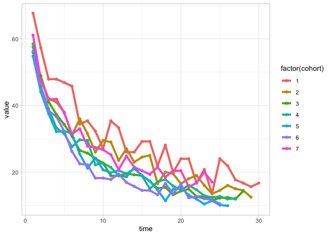

<!-- README.md is generated from README.Rmd. Please edit that file -->

# cohorts <a></a>

<!-- badges: start -->

[](https://github.com/PeerChristensen/cohorts/actions/workflows/R-CMD-check.yaml)
[](https://CRAN.R-project.org/package=cohorts)
[](https://cranlogs.r-pkg.org/badges/grand-total/cohorts)
<!-- badges: end -->

Creating cohort tables from event data is complicated and requires
several lines of code. The cohorts package lets users convert data
frames to cohort tables in both long and wide formats with simple
functions. Users may choose between day and month level cohorts.

## Installation

You can install the released version of cohorts from
[CRAN](https://CRAN.R-project.org) with:

``` r
install.packages("cohorts")
```

And the development version from [GitHub](https://github.com/) with:

``` r
# install.packages("devtools")
devtools::install_github("PeerChristensen/cohorts")
```

## Creating a month level cohort table

In this example, we use a dataset consisting of customer IDs and invoice
dates.

``` r
library(cohorts)

head(online_cohorts)
#>   CustomerID InvoiceDate
#> 1      17850  2010-12-01
#> 2      13047  2010-12-01
#> 3      12583  2010-12-01
#> 4      13748  2010-12-01
#> 5      15100  2010-12-01
#> 6      15291  2010-12-01
```

We can then turn this into a cohort table where each customer ID is
tracked from the first invoice month until the last month in the period.

``` r
online_cohorts %>%
  cohort_table_month(CustomerID, InvoiceDate)
#> # A tibble: 13 × 14
#>    cohort `Dec 2010` `Jan 2011` `Feb 2011` `Mar 2011` `Apr 2011` `May 2011`
#>     <int>      <int>      <int>      <int>      <int>      <int>      <int>
#>  1      1        949        363        318        368        342        377
#>  2      2         NA        421        101        119        102        138
#>  3      3         NA         NA        380         94         73        106
#>  4      4         NA         NA         NA        440         84        112
#>  5      5         NA         NA         NA         NA        299         68
#>  6      6         NA         NA         NA         NA         NA        279
#>  7      7         NA         NA         NA         NA         NA         NA
#>  8      8         NA         NA         NA         NA         NA         NA
#>  9      9         NA         NA         NA         NA         NA         NA
#> 10     10         NA         NA         NA         NA         NA         NA
#> 11     11         NA         NA         NA         NA         NA         NA
#> 12     12         NA         NA         NA         NA         NA         NA
#> 13     13         NA         NA         NA         NA         NA         NA
#> # … with 7 more variables: `Jun 2011` <int>, `Jul 2011` <int>,
#> #   `Aug 2011` <int>, `Sep 2011` <int>, `Oct 2011` <int>, `Nov 2011` <int>,
#> #   `Dec 2011` <int>
```

## Creating a day level cohort table

If we need to track activity on a daily basis, we can instead use the
`cohort_table_day()` function.

``` r
gamelaunch %>%
  cohort_table_day(userid, eventDate)
#> # A tibble: 31 × 32
#>    cohort `2016-04-27` `2016-04-28` `2016-04-29` `2016-04-30` `2016-05-01`
#>     <int>        <int>        <int>        <int>        <int>        <int>
#>  1      1           96           65           55           46           46
#>  2      2           NA          200          117           96           84
#>  3      3           NA           NA          370          207          181
#>  4      4           NA           NA           NA          387          223
#>  5      5           NA           NA           NA           NA          405
#>  6      6           NA           NA           NA           NA           NA
#>  7      7           NA           NA           NA           NA           NA
#>  8      8           NA           NA           NA           NA           NA
#>  9      9           NA           NA           NA           NA           NA
#> 10     10           NA           NA           NA           NA           NA
#> # … with 21 more rows, and 26 more variables: `2016-05-02` <int>,
#> #   `2016-05-03` <int>, `2016-05-04` <int>, `2016-05-05` <int>,
#> #   `2016-05-06` <int>, `2016-05-07` <int>, `2016-05-08` <int>,
#> #   `2016-05-09` <int>, `2016-05-10` <int>, `2016-05-11` <int>,
#> #   `2016-05-12` <int>, `2016-05-13` <int>, `2016-05-14` <int>,
#> #   `2016-05-15` <int>, `2016-05-16` <int>, `2016-05-17` <int>,
#> #   `2016-05-18` <int>, `2016-05-19` <int>, `2016-05-20` <int>, …
```

## Converting to percentages

In order to see the percent of remaining customers in subsequent
periods, we can pipe the above code into the `cohort_table_pct()`
function.

``` r
gamelaunch %>%
  cohort_table_day(userid, eventDate) %>%
  cohort_table_pct(decimals = 1)
#> # A tibble: 31 × 32
#>    cohort `2016-04-27` `2016-04-28` `2016-04-29` `2016-04-30` `2016-05-01`
#>     <int>        <dbl>        <dbl>        <dbl>        <dbl>        <dbl>
#>  1      1          100         67.7         57.3         47.9         47.9
#>  2      2           NA        100           58.5         48           42  
#>  3      3           NA         NA          100           55.9         48.9
#>  4      4           NA         NA           NA          100           57.6
#>  5      5           NA         NA           NA           NA          100  
#>  6      6           NA         NA           NA           NA           NA  
#>  7      7           NA         NA           NA           NA           NA  
#>  8      8           NA         NA           NA           NA           NA  
#>  9      9           NA         NA           NA           NA           NA  
#> 10     10           NA         NA           NA           NA           NA  
#> # … with 21 more rows, and 26 more variables: `2016-05-02` <dbl>,
#> #   `2016-05-03` <dbl>, `2016-05-04` <dbl>, `2016-05-05` <dbl>,
#> #   `2016-05-06` <dbl>, `2016-05-07` <dbl>, `2016-05-08` <dbl>,
#> #   `2016-05-09` <dbl>, `2016-05-10` <dbl>, `2016-05-11` <dbl>,
#> #   `2016-05-12` <dbl>, `2016-05-13` <dbl>, `2016-05-14` <dbl>,
#> #   `2016-05-15` <dbl>, `2016-05-16` <dbl>, `2016-05-17` <dbl>,
#> #   `2016-05-18` <dbl>, `2016-05-19` <dbl>, `2016-05-20` <dbl>, …
```

## Left-shifted cohort tables

Another option is to shift cohort tables left. Here, we align cohorts
such that date columns are replaced by time periods, i.e. t0, t1, t2
etc.

To left-shift a cohort table, we can use the `shift_left()` function.

``` r
gamelaunch %>%
  cohort_table_day(userid, eventDate) %>%
  shift_left()
#> # A tibble: 31 × 32
#>    cohort    t0    t1    t2    t3    t4    t5    t6    t7    t8    t9   t10
#>     <int> <dbl> <dbl> <dbl> <dbl> <dbl> <dbl> <dbl> <dbl> <dbl> <dbl> <dbl>
#>  1      1    96    65    55    46    46    45    44    33    34    31    26
#>  2      2   200   117    96    84    82    76    62    72    63    52    59
#>  3      3   370   207   181   152   138   127   114    98    95    89    84
#>  4      4   387   223   177   151   129   122   107   115   114    86    88
#>  5      5   405   222   178   152   130   131   128   103    86    98    84
#>  6      6   325   183   146   125   119   105    85    73    72    59    59
#>  7      7   270   165   129   113   113   102    85    89    75    74    72
#>  8      8   264   142   124    91    73    76    81    63    60    55    55
#>  9      9   267   153   114   110    99    94    89    72    68    62    65
#> 10     10   127    74    58    51    42    42    50    41    42    40    32
#> # … with 21 more rows, and 20 more variables: t11 <dbl>, t12 <dbl>, t13 <dbl>,
#> #   t14 <dbl>, t15 <dbl>, t16 <dbl>, t17 <dbl>, t18 <dbl>, t19 <dbl>,
#> #   t20 <dbl>, t21 <dbl>, t22 <dbl>, t23 <dbl>, t24 <dbl>, t25 <dbl>,
#> #   t26 <dbl>, t27 <dbl>, t28 <dbl>, t29 <dbl>, t30 <dbl>
```

We can also get the raw numbers as percentages.

``` r
gamelaunch %>%
  cohort_table_day(userid, eventDate) %>%
  shift_left_pct()
#> # A tibble: 31 × 32
#>    cohort    t0    t1    t2    t3    t4    t5    t6    t7    t8    t9   t10
#>     <int> <dbl> <dbl> <dbl> <dbl> <dbl> <dbl> <dbl> <dbl> <dbl> <dbl> <dbl>
#>  1      1   100  67.7  57.3  47.9  47.9  46.9  45.8  34.4  35.4  32.3  27.1
#>  2      2   100  58.5  48    42    41    38    31    36    31.5  26    29.5
#>  3      3   100  55.9  48.9  41.1  37.3  34.3  30.8  26.5  25.7  24.1  22.7
#>  4      4   100  57.6  45.7  39    33.3  31.5  27.6  29.7  29.5  22.2  22.7
#>  5      5   100  54.8  44    37.5  32.1  32.3  31.6  25.4  21.2  24.2  20.7
#>  6      6   100  56.3  44.9  38.5  36.6  32.3  26.2  22.5  22.2  18.2  18.2
#>  7      7   100  61.1  47.8  41.9  41.9  37.8  31.5  33    27.8  27.4  26.7
#>  8      8   100  53.8  47    34.5  27.7  28.8  30.7  23.9  22.7  20.8  20.8
#>  9      9   100  57.3  42.7  41.2  37.1  35.2  33.3  27    25.5  23.2  24.3
#> 10     10   100  58.3  45.7  40.2  33.1  33.1  39.4  32.3  33.1  31.5  25.2
#> # … with 21 more rows, and 20 more variables: t11 <dbl>, t12 <dbl>, t13 <dbl>,
#> #   t14 <dbl>, t15 <dbl>, t16 <dbl>, t17 <dbl>, t18 <dbl>, t19 <dbl>,
#> #   t20 <dbl>, t21 <dbl>, t22 <dbl>, t23 <dbl>, t24 <dbl>, t25 <dbl>,
#> #   t26 <dbl>, t27 <dbl>, t28 <dbl>, t29 <dbl>, t30 <dbl>
```

## Line plots

To visualize the data, we can turn a cohort table into long format and
create a line plot.

In this example, we select only the first seven cohorts.

``` r
library(tidyverse)

gamelaunch_long <- gamelaunch %>%
  cohort_table_day(userid, eventDate) %>%
  shift_left_pct() %>%
  pivot_longer(-cohort) %>%
  mutate(time = as.numeric(str_remove(name,"t"))) 

gamelaunch_long %>%
  filter(value > 0, cohort <= 7, time > 0) %>%
  ggplot(aes(time, value, colour = factor(cohort), group = cohort)) +
  geom_line(size = 1.5) +
  geom_point(size = 1.5) +
  theme_light()
```



## Cohort tables plotted

Another way to plot a cohort table is by means of tiles. In this case we
provide the percentages and colour the tiles accordingly.

``` r
gamelaunch_long %>%
  filter(time > 0, value > 0) %>%
  ggplot(aes(time, reorder(cohort, desc(cohort)))) +
  geom_raster(aes(fill = log(value))) +
  coord_equal(ratio = 1) +
  geom_text(aes(label = glue::glue("{round(value,0)}%")), size = 2, color = "snow") +
  scale_fill_gradient(guide = F) +
  theme_minimal() +
  theme(panel.grid   = element_blank(),
        panel.border = element_blank()) +
  labs(y= "cohort")
```


